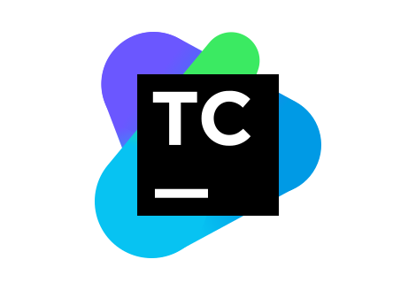

### Hi there, my name is Anna 👋

- 💼 I'm QA Engineer
- 🌱 Here you can see my demo autotests projects
- 📫 Reach me: Telegram @anna_abramovaa

### Tools and technologies:

  <code></code>
  <code></code>
  <code></code>
  <code></code>
  <code></code>
  <code></code>
  <code></code>
  <code></code>
  <code></code>
  <code></code>
  <code></code>
  <code></code>
  <code></code>
  <code></code>
  <code></code>

## My projects:

### :star: <a target="_blank" href="https://github.com/AnnaAnnenko/Avito_UIAutotestsProject">UI Autotests</a> for <a target="_blank" href="https://www.avito.ru/"> Avito.ru</a> website

### :star: <a target="_blank" href="https://github.com/AnnaAnnenko/RegresIn_APIAutotestsProject">API Autotests</a> for <a target="_blank" href="https://reqres.in/">Reqres.in</a> website

### :star: <a target="_blank" href="https://github.com/AnnaAnnenko/Wiki_MobileAutotestsProject">Mobile Autotests</a> for Wikipedia android app